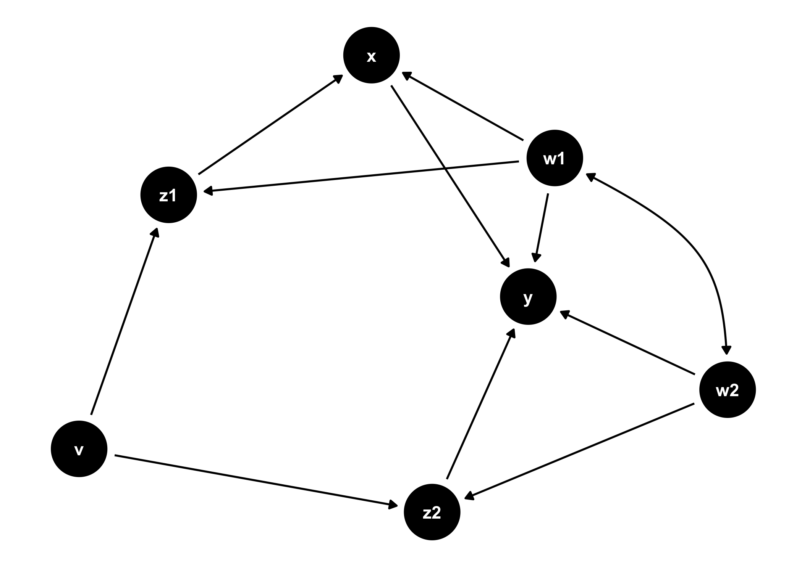
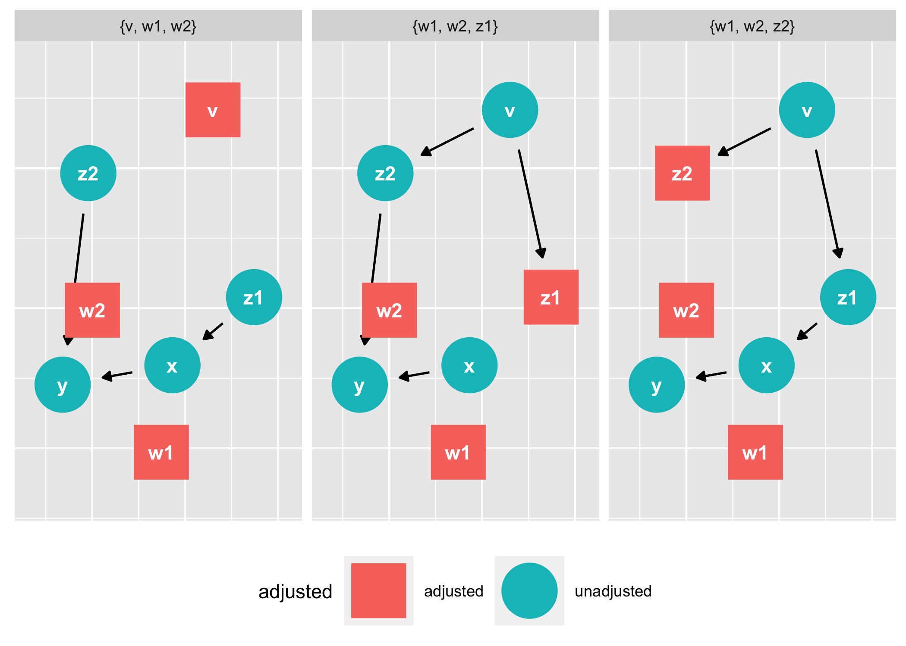
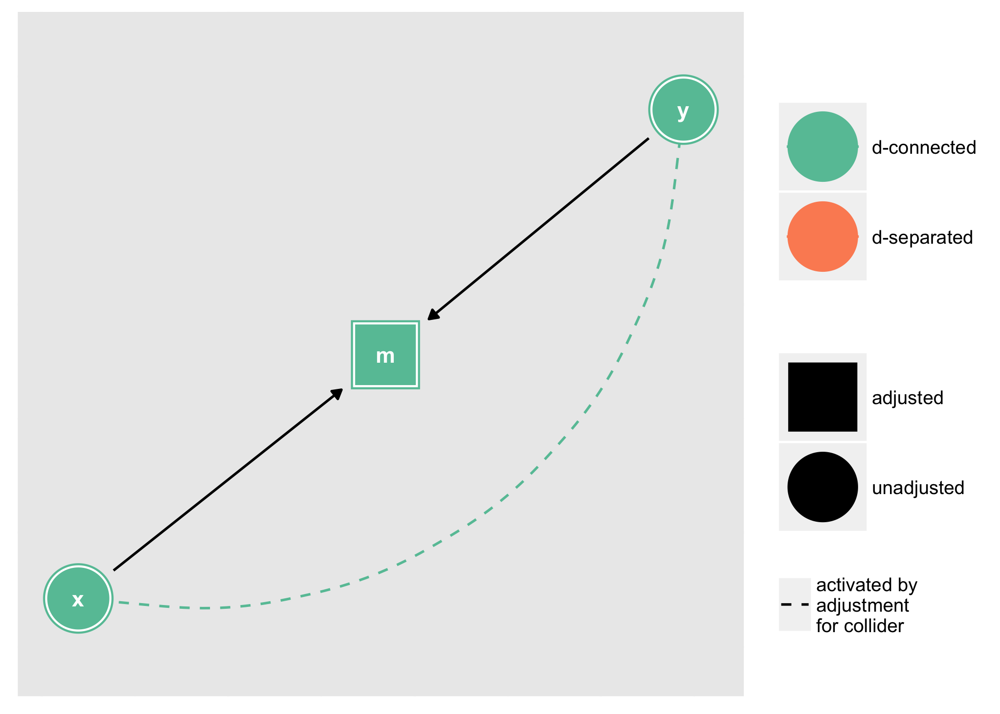
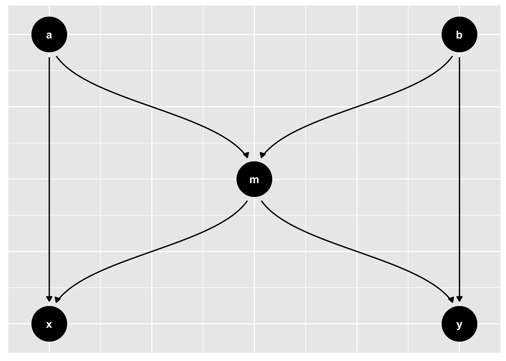

<!-- README.md is generated from README.Rmd. Please edit that file -->

[](https://travis-ci.org/malcolmbarrett/ggdag)
[](https://ci.appveyor.com/project/malcolmbarrett/ggdag)

# ggdag: An R Package for visualizing and analyzing directed acyclic graphs

Tidy, analyze, and plot directed acyclic graphs (DAGs). `ggdag` uses the
powerful `dagitty` package to create and analyze structural causal
models and plot them using `ggplot2` and `ggraph` in a consistent and
easy manner.

## Installation

You can install ggdag from GitHub with:

``` r
# install.packages("devtools")
devtools::install_github("malcolmbarrett/ggdag")
```

## Example

`ggdag` makes it easy to use `dagitty` in the context of the tidyverse.
You can directly tidy `dagitty` objects or use convenience functions to
create DAGs using a more R-like syntax:

``` r
library(ggdag)

#  example from the dagitty package
dag <- dagitty::dagitty( "dag {
    y <- x <- z1 <- v -> z2 -> y
               z1 <- w1 <-> w2 -> z2
               x <- w1 -> y
               x <- w2 -> y
               x [exposure]
               y [outcome]
               }")

tidy_dag <- tidy_dagitty(dag)

tidy_dag 
#> # A tibble: 13 x 8
#>    name      x     y direction to     xend  yend circular
#>    <chr> <dbl> <dbl> <fct>     <chr> <dbl> <dbl> <lgl>   
#>  1 v     11.8   8.03 ->        z1    10.4   7.77 FALSE   
#>  2 v     11.8   8.03 ->        z2    12.1   6.66 FALSE   
#>  3 w1    10.2   6.85 ->        x      9.95  6.28 FALSE   
#>  4 w1    10.2   6.85 ->        y     11.1   6.39 FALSE   
#>  5 w1    10.2   6.85 ->        z1    10.4   7.77 FALSE   
#>  6 w1    10.2   6.85 <->       w2    10.9   5.75 FALSE   
#>  7 w2    10.9   5.75 ->        x      9.95  6.28 FALSE   
#>  8 w2    10.9   5.75 ->        y     11.1   6.39 FALSE   
#>  9 w2    10.9   5.75 ->        z2    12.1   6.66 FALSE   
#> 10 x      9.95  6.28 ->        y     11.1   6.39 FALSE   
#> 11 z1    10.4   7.77 ->        x      9.95  6.28 FALSE   
#> 12 z2    12.1   6.66 ->        y     11.1   6.39 FALSE   
#> 13 y     11.1   6.39 <NA>      <NA>  NA    NA    FALSE

#  using more R-like syntax to create the same DAG
tidy_ggdag <- dagify(y ~ x + z2 + w2 + w1,
             x ~ z1 + w1,
             z1 ~ w1 + v,
             z2 ~ w2 + v,
             w1 ~~ w2, # bidirected path
             exposure = "x",
             outcome = "y") %>% tidy_dagitty()

tidy_ggdag
#> # A tibble: 12 x 8
#>    name      x     y direction to     xend  yend circular
#>    <chr> <dbl> <dbl> <fct>     <chr> <dbl> <dbl> <lgl>   
#>  1 v      7.25  17.2 ->        z1     7.59  18.5 FALSE   
#>  2 v      7.25  17.2 ->        z2     8.57  16.8 FALSE   
#>  3 w1     9.03  18.7 ->        x      8.35  19.3 FALSE   
#>  4 w1     9.03  18.7 ->        y      8.93  18.0 FALSE   
#>  5 w1     9.03  18.7 ->        z1     7.59  18.5 FALSE   
#>  6 w1     9.03  18.7 <->       w2     9.68  17.5 FALSE   
#>  7 w2     9.68  17.5 ->        y      8.93  18.0 FALSE   
#>  8 w2     9.68  17.5 ->        z2     8.57  16.8 FALSE   
#>  9 x      8.35  19.3 ->        y      8.93  18.0 FALSE   
#> 10 z1     7.59  18.5 ->        x      8.35  19.3 FALSE   
#> 11 z2     8.57  16.8 ->        y      8.93  18.0 FALSE   
#> 12 y      8.93  18.0 <NA>      <NA>  NA     NA   FALSE
```

`ggdag` also provides functionality for analyzing DAGs and plotting them
in `ggplot2`:

``` r
ggdag(tidy_ggdag)
```



``` r
ggdag_adjustment_set(tidy_ggdag)
```



As well as geoms and other functions for plotting them directly in
`ggplot2`:

``` r
dagify(m ~ x + y) %>% 
  tidy_dagitty() %>% 
  node_dconnected("x", "y", controlling_for = "m") %>%
  ggplot(aes(x = x, y = y, xend = xend, yend = yend, shape = adjusted, col = d_relationship)) +
    geom_dag_edges(aes(end_cap = ggraph::circle(10, "mm"))) +
    geom_dag_collider_edges() +
    geom_dag_node() +
    geom_dag_text(col = "white") +
    theme_dag() + 
    scale_dag(expand_y = expand_scale(c(0.2, 0.2)))
```



And common structures of bias:

``` r
ggdag_equivalent_dags(confounder_triangle())
```


``` r

ggdag_butterfly_bias(edge_type = "diagonal")
```


