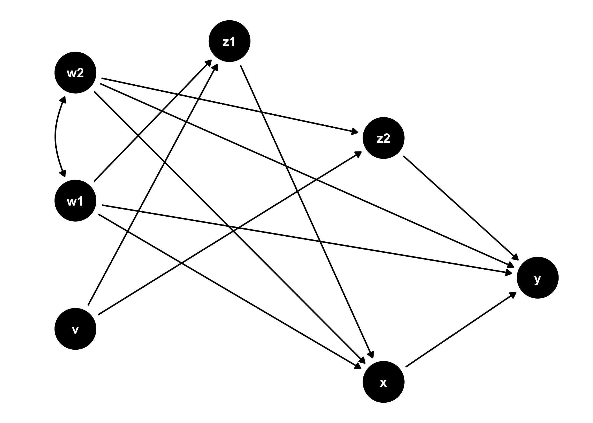
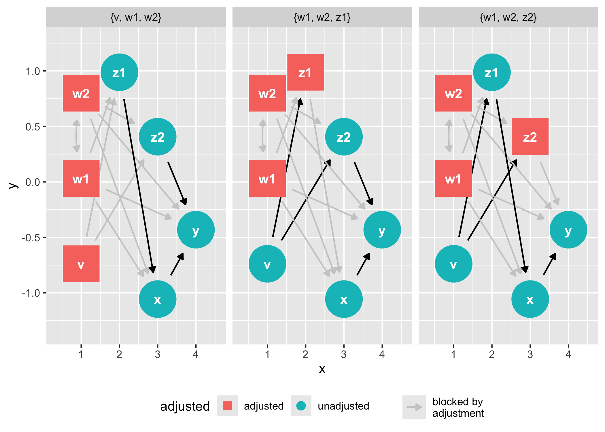
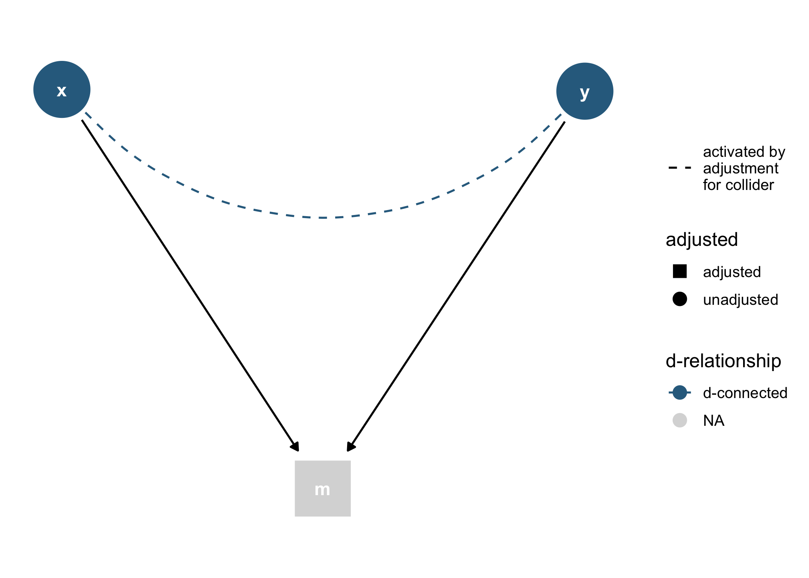
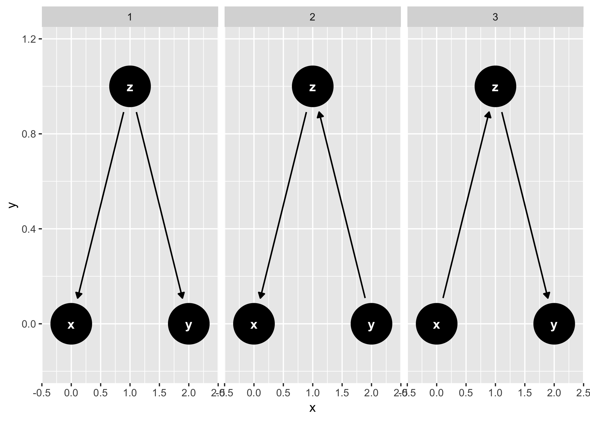
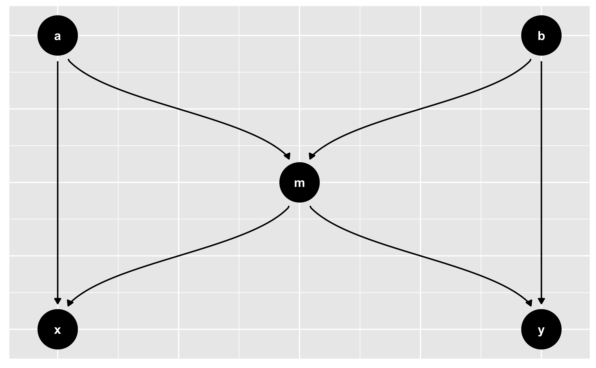

<!-- README.md is generated from README.Rmd. Please edit that file -->

<!-- badges: start -->

[](https://travis-ci.org/malcolmbarrett/ggdag)
[](https://ci.appveyor.com/project/malcolmbarrett/ggdag)
[](https://cran.r-project.org/package=ggdag)
[](https://www.tidyverse.org/lifecycle/#maturing)
[](https://codecov.io/gh/malcolmbarrett/ggdag?branch=master)
[](https://cran.r-project.org/package=ggdag)
<!-- badges: end -->

# ggdag: An R Package for visualizing and analyzing causal directed acyclic graphs

Tidy, analyze, and plot causal directed acyclic graphs (DAGs). `ggdag`
uses the powerful `dagitty` package to create and analyze structural
causal models and plot them using `ggplot2` and `ggraph` in a consistent
and easy manner.

## Installation

You can install `ggdag` with:

``` r
install.packages("ggdag")
```

Or you can install the development version from GitHub with:

``` r
# install.packages("devtools")
devtools::install_github("malcolmbarrett/ggdag")
```

## Example

`ggdag` makes it easy to use `dagitty` in the context of the tidyverse.
You can directly tidy `dagitty` objects or use convenience functions to
create DAGs using a more R-like syntax:

``` r
library(ggdag)

#  example from the dagitty package
dag <- dagitty::dagitty("dag {
    y <- x <- z1 <- v -> z2 -> y
    z1 <- w1 <-> w2 -> z2
    x <- w1 -> y
    x <- w2 -> y
    x [exposure]
    y [outcome]
  }"
)

tidy_dag <- tidy_dagitty(dag)

tidy_dag 
#> # A DAG with 7 nodes and 12 edges
#> #
#> # Exposure: x
#> # Outcome: y
#> #
#> # A tibble: 13 x 8
#>    name      x     y direction to     xend  yend circular
#>    <chr> <dbl> <dbl> <fct>     <chr> <dbl> <dbl> <lgl>   
#>  1 v     11.8   8.03 ->        z1    10.4   7.77 FALSE   
#>  2 v     11.8   8.03 ->        z2    12.1   6.66 FALSE   
#>  3 w1    10.2   6.85 ->        x      9.95  6.28 FALSE   
#>  4 w1    10.2   6.85 ->        y     11.1   6.39 FALSE   
#>  5 w1    10.2   6.85 ->        z1    10.4   7.77 FALSE   
#>  6 w1    10.2   6.85 <->       w2    10.9   5.75 FALSE   
#>  7 w2    10.9   5.75 ->        x      9.95  6.28 FALSE   
#>  8 w2    10.9   5.75 ->        y     11.1   6.39 FALSE   
#>  9 w2    10.9   5.75 ->        z2    12.1   6.66 FALSE   
#> 10 x      9.95  6.28 ->        y     11.1   6.39 FALSE   
#> 11 z1    10.4   7.77 ->        x      9.95  6.28 FALSE   
#> 12 z2    12.1   6.66 ->        y     11.1   6.39 FALSE   
#> 13 y     11.1   6.39 <NA>      <NA>  NA    NA    FALSE

#  using more R-like syntax to create the same DAG
tidy_ggdag <- dagify(
  y ~ x + z2 + w2 + w1,
  x ~ z1 + w1 + w2,
  z1 ~ w1 + v,
  z2 ~ w2 + v,
  w1 ~~ w2, # bidirected path
  exposure = "x",
  outcome = "y"
) %>% 
  tidy_dagitty()

tidy_ggdag
#> # A DAG with 7 nodes and 12 edges
#> #
#> # Exposure: x
#> # Outcome: y
#> #
#> # A tibble: 13 x 8
#>    name      x     y direction to     xend  yend circular
#>    <chr> <dbl> <dbl> <fct>     <chr> <dbl> <dbl> <lgl>   
#>  1 v      9.30  13.4 ->        z1     9.74  12.1 FALSE   
#>  2 v      9.30  13.4 ->        z2     7.96  13.0 FALSE   
#>  3 w1     8.74  11.0 ->        x      8.86  11.6 FALSE   
#>  4 w1     8.74  11.0 ->        y      7.68  11.5 FALSE   
#>  5 w1     8.74  11.0 ->        z1     9.74  12.1 FALSE   
#>  6 w1     8.74  11.0 <->       w2     8.00  12.0 FALSE   
#>  7 w2     8.00  12.0 ->        x      8.86  11.6 FALSE   
#>  8 w2     8.00  12.0 ->        y      7.68  11.5 FALSE   
#>  9 w2     8.00  12.0 ->        z2     7.96  13.0 FALSE   
#> 10 x      8.86  11.6 ->        y      7.68  11.5 FALSE   
#> 11 z1     9.74  12.1 ->        x      8.86  11.6 FALSE   
#> 12 z2     7.96  13.0 ->        y      7.68  11.5 FALSE   
#> 13 y      7.68  11.5 <NA>      <NA>  NA     NA   FALSE
```

`ggdag` also provides functionality for analyzing DAGs and plotting them
in `ggplot2`:

``` r
ggdag(tidy_ggdag) +
  theme_dag()
```



``` r
ggdag_adjustment_set(tidy_ggdag, node_size = 14) + 
  theme(legend.position = "bottom")
```



As well as geoms and other functions for plotting them directly in
`ggplot2`:

``` r
dagify(m ~ x + y) %>% 
  tidy_dagitty() %>% 
  node_dconnected("x", "y", controlling_for = "m") %>%
  ggplot(aes(
    x = x, 
    y = y, 
    xend = xend, 
    yend = yend, 
    shape = adjusted, 
    col = d_relationship
  )) +
    geom_dag_edges(aes(end_cap = ggraph::circle(10, "mm"))) +
    geom_dag_collider_edges() +
    geom_dag_point() +
    geom_dag_text(col = "white") +
    theme_dag() + 
    scale_adjusted() +
    expand_plot(expand_y = expansion(c(0.2, 0.2))) +
    scale_color_viridis_d(
      name = "d-relationship", 
      na.value = "grey85", 
      begin = .35
    ) 
```



And common structures of bias:

``` r
ggdag_equivalent_dags(confounder_triangle())
```



``` r

ggdag_butterfly_bias(edge_type = "diagonal")
```


