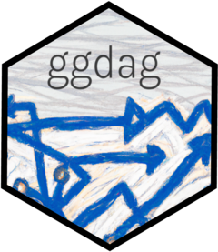
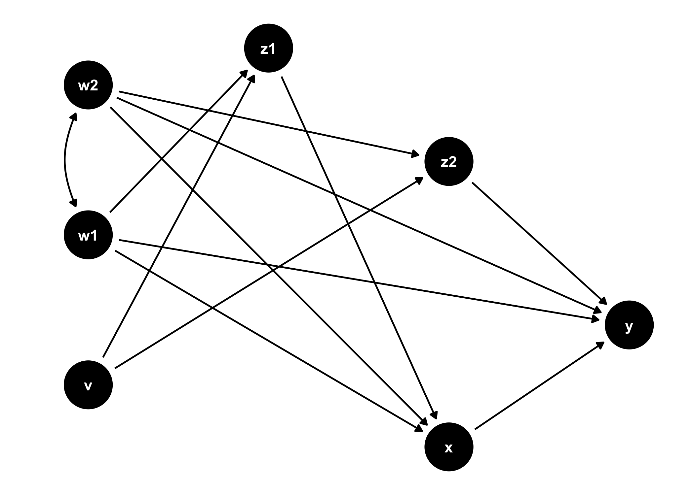
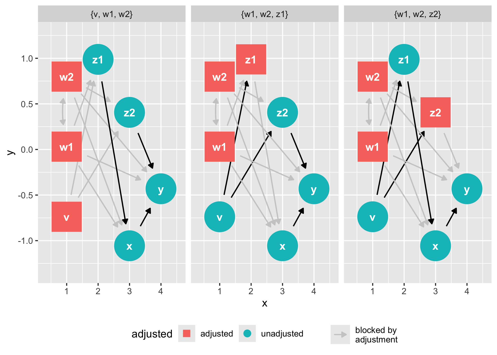
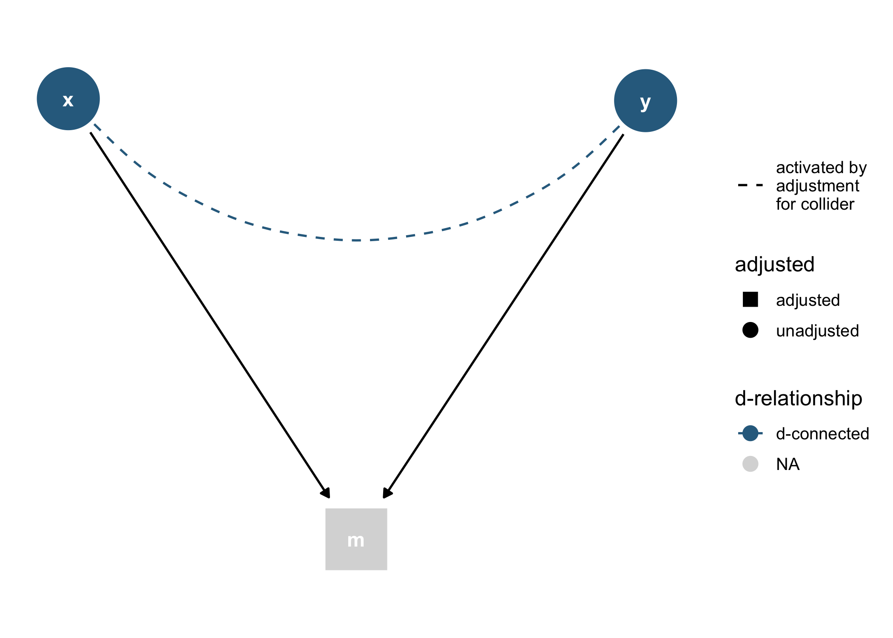
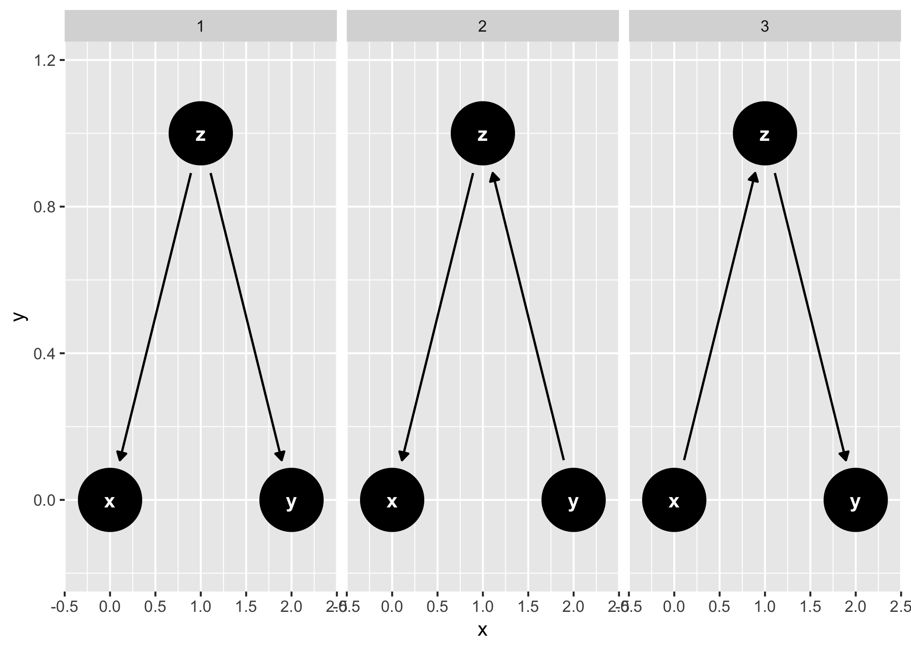
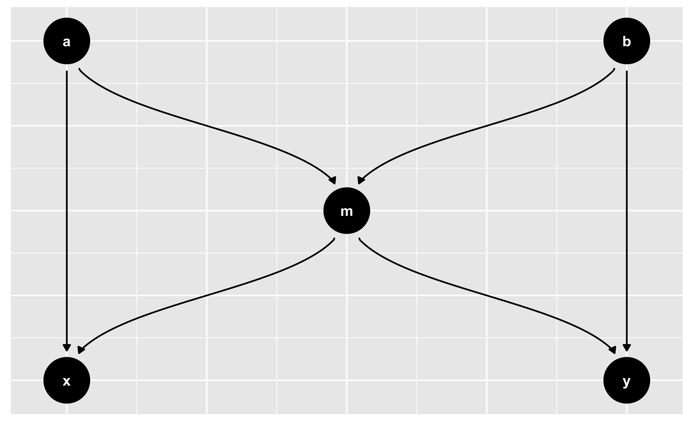

<!-- README.md is generated from README.Rmd. Please edit that file -->

<!-- badges: start -->

[](https://github.com/r-causal/ggdag/actions)
[](https://cran.r-project.org/package=ggdag)
[](https://lifecycle.r-lib.org/articles/stages.html)
[](https://app.codecov.io/gh/malcolmbarrett/ggdag?branch=main)
[](https://cran.r-project.org/package=ggdag)
[](https://github.com/malcolmbarrett/ggdag/actions/workflows/R-CMD-check.yaml)
<!-- badges: end -->

# ggdag: An R Package for visualizing and analyzing causal directed acyclic graphs <a href="https://r-causal.github.io/ggdag/"></a>

Tidy, analyze, and plot causal directed acyclic graphs (DAGs). `ggdag`
uses the powerful `dagitty` package to create and analyze structural
causal models and plot them using `ggplot2` and `ggraph` in a consistent
and easy manner.

## Installation

You can install `ggdag` with:

``` r
install.packages("ggdag")
```

Or you can install the development version from GitHub with:

``` r
# install.packages("devtools")
devtools::install_github("r-causal/ggdag")
```

## Example

`ggdag` makes it easy to use `dagitty` in the context of the tidyverse.
You can directly tidy `dagitty` objects or use convenience functions to
create DAGs using a more R-like syntax:

``` r
library(ggdag)
library(ggplot2)

#  example from the dagitty package
dag <- dagitty::dagitty("dag {
    y <- x <- z1 <- v -> z2 -> y
    z1 <- w1 <-> w2 -> z2
    x <- w1 -> y
    x <- w2 -> y
    x [exposure]
    y [outcome]
  }")

tidy_dag <- tidy_dagitty(dag)

tidy_dag
#> # DAG:
#> # A `dagitty` DAG with: 7 nodes and 12 edges
#> # Exposure: x
#> # Outcome: y
#> #
#> # Data:
#> # A tibble: 13 × 7
#>    name       x       y direction to      xend   yend
#>    <chr>  <dbl>   <dbl> <fct>     <chr>  <dbl>  <dbl>
#>  1 v     -1.51   0.0323 ->        z1    -0.473  1.00 
#>  2 v     -1.51   0.0323 ->        z2    -0.553 -0.995
#>  3 w1     0.986  0.515  ->        x      0.368  0.518
#>  4 w1     0.986  0.515  ->        y      0.289 -0.432
#>  5 w1     0.986  0.515  ->        z1    -0.473  1.00 
#>  6 w1     0.986  0.515  <->       w2     0.891 -0.641
#>  7 w2     0.891 -0.641  ->        x      0.368  0.518
#>  8 w2     0.891 -0.641  ->        y      0.289 -0.432
#>  9 w2     0.891 -0.641  ->        z2    -0.553 -0.995
#> 10 x      0.368  0.518  ->        y      0.289 -0.432
#> 11 y      0.289 -0.432  <NA>      <NA>  NA     NA    
#> 12 z1    -0.473  1.00   ->        x      0.368  0.518
#> 13 z2    -0.553 -0.995  ->        y      0.289 -0.432
#> #
#> # ℹ Use `pull_dag() (`?pull_dag`)` to retrieve the DAG object and `pull_dag_data() (`?pull_dag_data`)` for the data frame

#  using more R-like syntax to create the same DAG
tidy_ggdag <- dagify(
  y ~ x + z2 + w2 + w1,
  x ~ z1 + w1 + w2,
  z1 ~ w1 + v,
  z2 ~ w2 + v,
  w1 ~ ~w2, # bidirected path
  exposure = "x",
  outcome = "y",
  coords = time_ordered_coords()
) |>
  tidy_dagitty()

tidy_ggdag
#> # DAG:
#> # A `dagitty` DAG with: 7 nodes and 12 edges
#> # Exposure: x
#> # Outcome: y
#> #
#> # Data:
#> # A tibble: 13 × 7
#>    name      x      y direction to     xend   yend
#>    <chr> <int>  <dbl> <fct>     <chr> <int>  <dbl>
#>  1 v         1 -0.738 ->        z1        2  0.988
#>  2 v         1 -0.738 ->        z2        3  0.407
#>  3 w1        1  0.031 ->        x         3 -1.06 
#>  4 w1        1  0.031 ->        y         4 -0.431
#>  5 w1        1  0.031 ->        z1        2  0.988
#>  6 w1        1  0.031 <->       w2        1  0.799
#>  7 w2        1  0.799 ->        x         3 -1.06 
#>  8 w2        1  0.799 ->        y         4 -0.431
#>  9 w2        1  0.799 ->        z2        3  0.407
#> 10 x         3 -1.06  ->        y         4 -0.431
#> 11 y         4 -0.431 <NA>      <NA>     NA NA    
#> 12 z1        2  0.988 ->        x         3 -1.06 
#> 13 z2        3  0.407 ->        y         4 -0.431
#> #
#> # ℹ Use `pull_dag() (`?pull_dag`)` to retrieve the DAG object and `pull_dag_data() (`?pull_dag_data`)` for the data frame
```

`ggdag` also provides functionality for analyzing DAGs and plotting them
in `ggplot2`:

``` r
ggdag(tidy_ggdag) +
  theme_dag()
```



``` r
ggdag_adjustment_set(tidy_ggdag, node_size = 14) +
  theme(legend.position = "bottom")
```



As well as geoms and other functions for plotting them directly in
`ggplot2`:

``` r
dagify(m ~ x + y) |>
  tidy_dagitty() |>
  node_dconnected("x", "y", controlling_for = "m") |>
  ggplot(aes(
    x = x,
    y = y,
    xend = xend,
    yend = yend,
    shape = adjusted,
    col = d_relationship
  )) +
  geom_dag_edges(end_cap = ggraph::circle(10, "mm")) +
  geom_dag_collider_edges() +
  geom_dag_point() +
  geom_dag_text(col = "white") +
  theme_dag() +
  scale_adjusted(include_color = FALSE) +
  expand_plot(expand_y = expansion(c(0.2, 0.2))) +
  scale_color_viridis_d(
    name = "d-relationship",
    na.value = "grey85",
    begin = .35
  )
```



And common structures of bias:

``` r
ggdag_equivalent_dags(confounder_triangle())
```



``` r

ggdag_butterfly_bias(edge_type = "diagonal")
```


