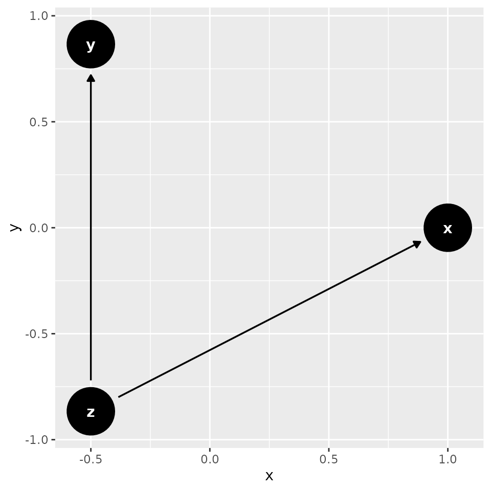
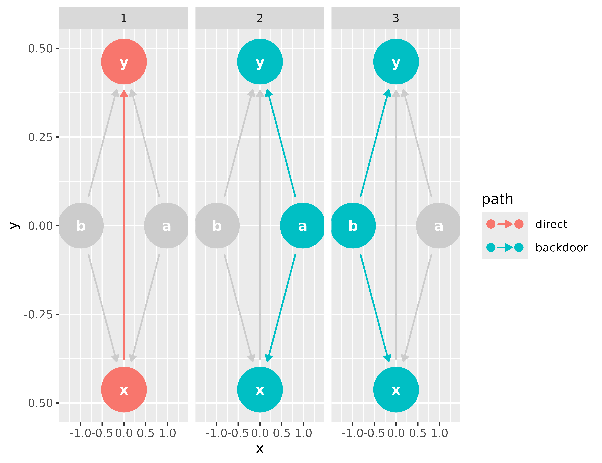
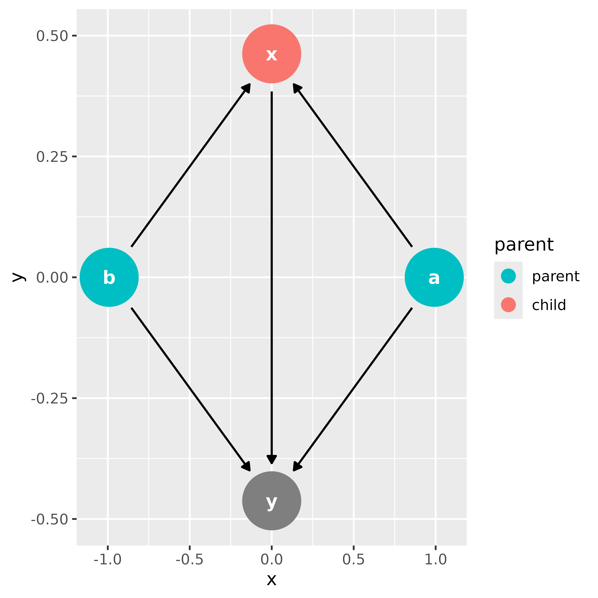
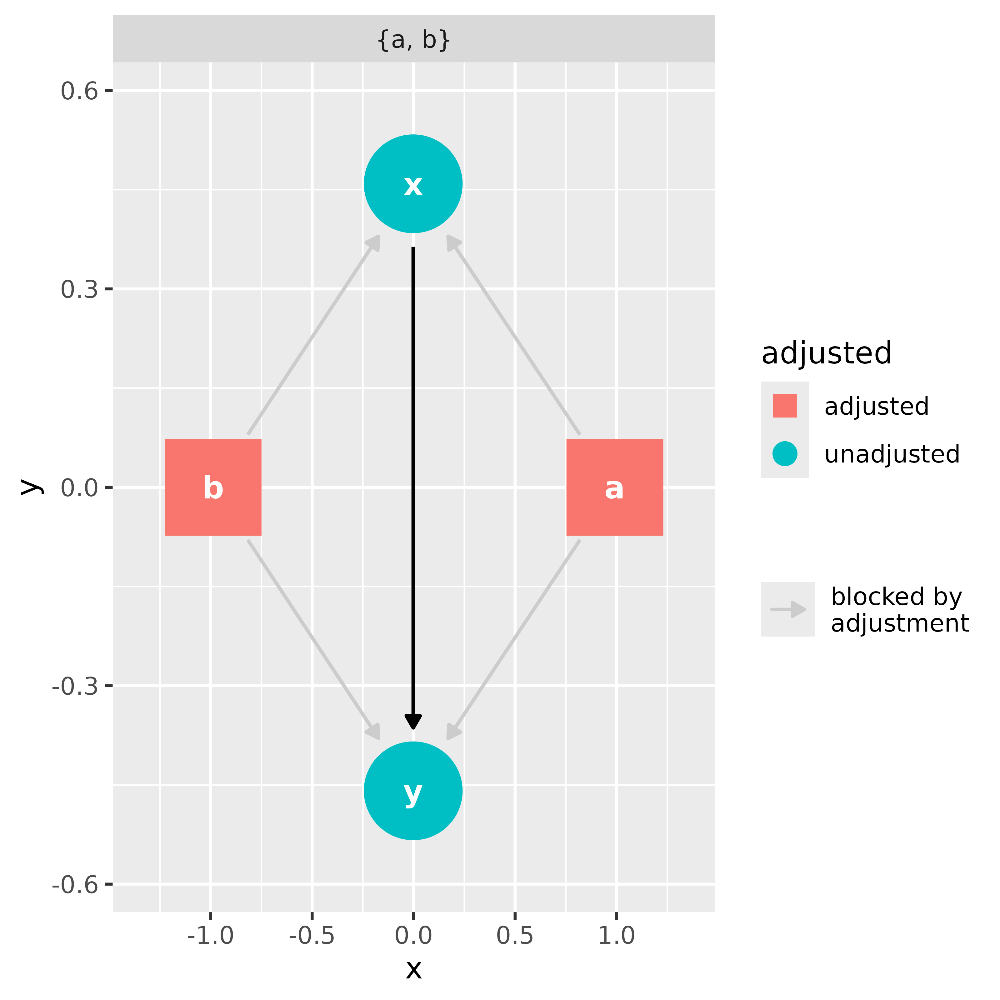
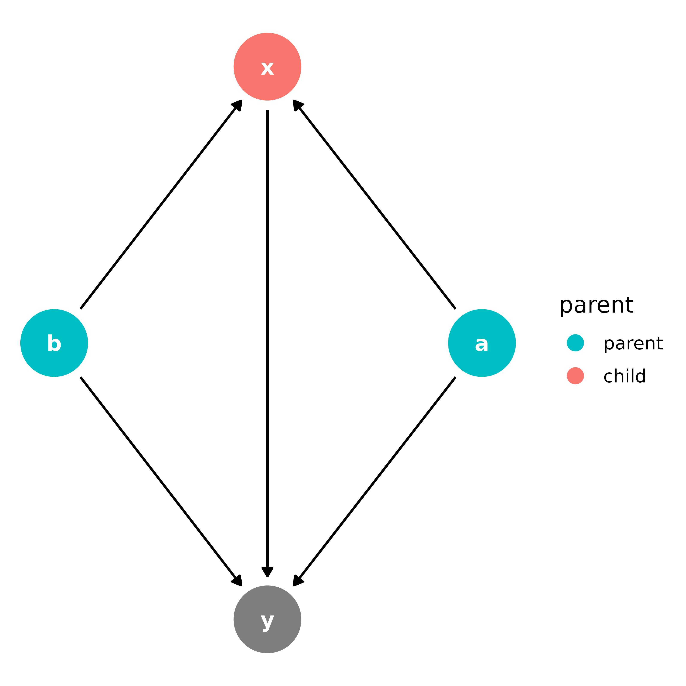
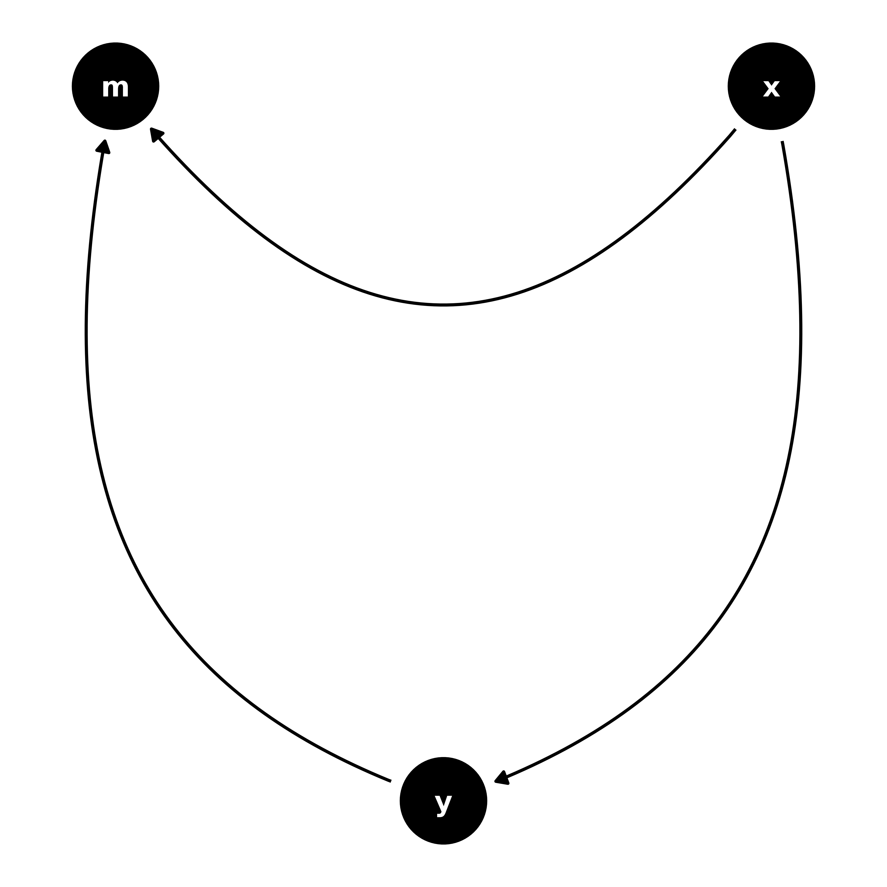
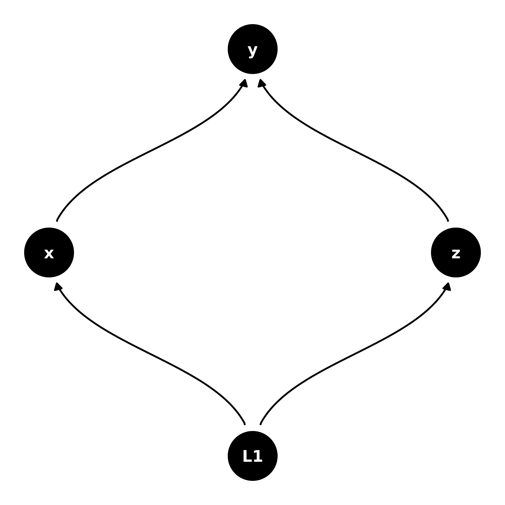

# An Introduction to ggdag

## Overview

`ggdag` extends the powerful `dagitty` package to work in the context of
the tidyverse. It uses `dagitty`’s algorithms for analyzing structural
causal graphs to produce tidy results, which can then be used in
`ggplot2` and `ggraph` and manipulated with other tools from the
tidyverse, like `dplyr`.

## Creating Directed Acyclic Graphs

If you already use `dagitty`, `ggdag` can tidy your DAG directly.

``` r
library(dagitty)
library(ggdag)
library(ggplot2)

dag <- dagitty("dag{y <- z -> x}")
tidy_dagitty(dag)
#> # DAG:
#> # A `dagitty` DAG with: 3 nodes and 2 edges
#> #
#> # Data:
#> # A tibble: 4 × 7
#>   name      x     y direction to     xend  yend
#>   <chr> <dbl> <dbl> <fct>     <chr> <dbl> <dbl>
#> 1 x      -0.5     0 NA        NA     NA      NA
#> 2 y       0.5     0 NA        NA     NA      NA
#> 3 z       0       1 ->        x      -0.5     0
#> 4 z       0       1 ->        y       0.5     0
#> #
#> # ℹ Use `pull_dag() (`?pull_dag`)` to retrieve the DAG object and `pull_dag_data() (`?pull_dag_data`)` for the data frame
```

Note that, while `dagitty` supports a number of graph types, `ggdag`
currently only supports DAGs.

`dagitty` uses a syntax similar to the [dot language of
graphviz](https://graphviz.gitlab.io/doc/info/lang.html). This syntax
has the advantage of being compact, but `ggdag` also provides the
ability to create a `dagitty` object using a more R-like formula syntax
through the
[`dagify()`](https://r-causal.github.io/ggdag/reference/dagify.md)
function.
[`dagify()`](https://r-causal.github.io/ggdag/reference/dagify.md)
accepts any number of formulas to create a DAG. It also has options for
declaring which variables are exposures, outcomes, or latent, as well as
coordinates and labels for each node.

``` r
dagified <- dagify(
  x ~ z,
  y ~ z,
  exposure = "x",
  outcome = "y"
)
tidy_dagitty(dagified)
#> # DAG:
#> # A `dagitty` DAG with: 3 nodes and 2 edges
#> # Exposure: x
#> # Outcome: y
#> #
#> # Data:
#> # A tibble: 4 × 7
#>   name      x     y direction to     xend  yend
#>   <chr> <dbl> <dbl> <fct>     <chr> <dbl> <dbl>
#> 1 x      -0.5     0 NA        NA     NA      NA
#> 2 y       0.5     0 NA        NA     NA      NA
#> 3 z       0       1 ->        x      -0.5     0
#> 4 z       0       1 ->        y       0.5     0
#> #
#> # ℹ Use `pull_dag() (`?pull_dag`)` to retrieve the DAG object and `pull_dag_data() (`?pull_dag_data`)` for the data frame
```

Currently, `ggdag` supports directed (`x ~ y`) and bi-directed
(`a ~~ b`) relationships

[`tidy_dagitty()`](https://r-causal.github.io/ggdag/reference/tidy_dagitty.md)
uses layout functions from `ggraph` and `igraph` for coordinates if none
are provided, which can be specified with the `layout` argument. Objects
of class `tidy_dagitty` or `dagitty` can be plotted quickly with
[`ggdag()`](https://r-causal.github.io/ggdag/reference/ggdag.md). If the
DAG is not yet tidied,
[`ggdag()`](https://r-causal.github.io/ggdag/reference/ggdag.md) and
most other quick plotting functions in `ggdag` do so internally.

``` r
ggdag(dag, layout = "circle")
```



A `tidy_dagitty` object is just a list with a `tbl_df`, called `data`,
and the `dagitty` object, called `dag`:

``` r
tidy_dag <- tidy_dagitty(dagified)
str(tidy_dag)
#> List of 2
#>  $ data: tibble [4 × 7] (S3: tbl_df/tbl/data.frame)
#>   ..$ name     : chr [1:4] "x" "y" "z" "z"
#>   ..$ x        : num [1:4] -0.5 0.5 0 0
#>   ..$ y        : num [1:4] 0 0 1 1
#>   ..$ direction: Factor w/ 3 levels "->","<->","--": NA NA 1 1
#>   ..$ to       : chr [1:4] NA NA "x" "y"
#>   ..$ xend     : num [1:4] NA NA -0.5 0.5
#>   ..$ yend     : num [1:4] NA NA 0 0
#>   ..- attr(*, "circular")= logi FALSE
#>  $ dag : 'dagitty' Named chr "dag {\nx [exposure,pos=\"-0.500,0.000\"]\ny [outcome,pos=\"0.500,0.000\"]\nz [pos=\"0.000,1.000\"]\nz -> x\nz -> y\n}\n"
#>  - attr(*, "class")= chr "tidy_dagitty"
```

## Working with DAGs

Most of the analytic functions in `dagitty` have extensions in `ggdag`
and are named `dag_*()` or `node_*()`, depending on if they are working
with specific nodes or the entire DAG. A simple example is
[`node_parents()`](https://r-causal.github.io/ggdag/reference/variable_family.md),
which adds a column to the to the `tidy_dagitty` object about the
parents of a given variable:

``` r
node_parents(tidy_dag, "x")
#> # DAG:
#> # A `dagitty` DAG with: 3 nodes and 2 edges
#> # Exposure: x
#> # Outcome: y
#> #
#> # Data:
#> # A tibble: 4 × 8
#>   name      x     y direction to     xend  yend parent
#>   <chr> <dbl> <dbl> <fct>     <chr> <dbl> <dbl> <fct> 
#> 1 x      -0.5     0 NA        NA     NA      NA child 
#> 2 y       0.5     0 NA        NA     NA      NA NA    
#> 3 z       0       1 ->        x      -0.5     0 parent
#> 4 z       0       1 ->        y       0.5     0 parent
#> #
#> # ℹ Use `pull_dag() (`?pull_dag`)` to retrieve the DAG object and `pull_dag_data() (`?pull_dag_data`)` for the data frame
```

Or working with the entire DAG to produce a `tidy_dagitty` that has all
pathways between two variables:

``` r
bigger_dag <- dagify(
  y ~ x + a + b,
  x ~ a + b,
  exposure = "x",
  outcome = "y"
)
#  automatically searches the paths between the variables labelled exposure and
#  outcome
dag_paths(bigger_dag)
#> # DAG:
#> # A `dagitty` DAG with: 4 nodes and 5 edges
#> # Exposure: x
#> # Outcome: y
#> # Paths: 3 open paths: {x -> y}, {x <- a -> y}, {x <- b -> y}
#> #
#> # Data:
#> # A tibble: 20 × 10
#>    set   name          x         y direction to         xend   yend path     
#>    <chr> <chr>     <dbl>     <dbl> <fct>     <chr>     <dbl>  <dbl> <chr>    
#>  1 1     a     -9.91e- 1  1.51e- 9 ->        x      9.27e-10  0.464 NA       
#>  2 1     a     -9.91e- 1  1.51e- 9 ->        y     -7.75e-10 -0.464 NA       
#>  3 1     b      9.91e- 1 -7.97e-11 ->        x      9.27e-10  0.464 NA       
#>  4 1     b      9.91e- 1 -7.97e-11 ->        y     -7.75e-10 -0.464 NA       
#>  5 1     x      9.27e-10  4.64e- 1 ->        y     -7.75e-10 -0.464 open path
#>  6 1     y     -7.75e-10 -4.64e- 1 NA        NA    NA        NA     open path
#>  7 2     a     -9.91e- 1  1.51e- 9 ->        x      9.27e-10  0.464 open path
#>  8 2     a     -9.91e- 1  1.51e- 9 ->        y     -7.75e-10 -0.464 open path
#>  9 2     b      9.91e- 1 -7.97e-11 ->        x      9.27e-10  0.464 NA       
#> 10 2     b      9.91e- 1 -7.97e-11 ->        y     -7.75e-10 -0.464 NA       
#> 11 2     x      9.27e-10  4.64e- 1 ->        y     -7.75e-10 -0.464 NA       
#> 12 2     y     -7.75e-10 -4.64e- 1 NA        NA    NA        NA     open path
#> 13 2     x      9.27e-10  4.64e- 1 NA        NA    NA        NA     open path
#> 14 3     a     -9.91e- 1  1.51e- 9 ->        x      9.27e-10  0.464 NA       
#> 15 3     a     -9.91e- 1  1.51e- 9 ->        y     -7.75e-10 -0.464 NA       
#> 16 3     b      9.91e- 1 -7.97e-11 ->        x      9.27e-10  0.464 open path
#> 17 3     b      9.91e- 1 -7.97e-11 ->        y     -7.75e-10 -0.464 open path
#> 18 3     x      9.27e-10  4.64e- 1 ->        y     -7.75e-10 -0.464 NA       
#> 19 3     y     -7.75e-10 -4.64e- 1 NA        NA    NA        NA     open path
#> 20 3     x      9.27e-10  4.64e- 1 NA        NA    NA        NA     open path
#> # ℹ 1 more variable: path_type <chr>
#> #
#> # ℹ Use `pull_dag() (`?pull_dag`)` to retrieve the DAG object and `pull_dag_data() (`?pull_dag_data`)` for the data frame
```

`ggdag` also supports [piping](https://r4ds.had.co.nz/pipes.html) of
functions and includes the pipe internally (so you don’t need to load
`dplyr` or `magrittr`). Basic `dplyr` verbs are also supported (and
anything more complex can be done directly on the `data` object).

``` r
library(dplyr)
#  find how many variables are in between x and y in each path
bigger_dag |>
  dag_paths() |>
  group_by(set) |>
  filter(!is.na(path) & !is.na(name)) |>
  summarize(n_vars_between = n() - 1L)
#> # A tibble: 1 × 1
#>   n_vars_between
#>            <int>
#> 1              9
```

## Plotting DAGs

Most `dag_*()` and `node_*()` functions have corresponding `ggdag_*()`
for quickly plotting the results. They call the corresponding `dag_*()`
or `node_*()` function internally and plot the results in `ggplot2`.

``` r
ggdag_paths(bigger_dag)
```



``` r
ggdag_parents(bigger_dag, "x")
```



``` r
#  quickly get the miniminally sufficient adjustment sets to adjust for when
#  analyzing the effect of x on y
ggdag_adjustment_set(bigger_dag)
```



## Plotting directly in `ggplot2`

[`ggdag()`](https://r-causal.github.io/ggdag/reference/ggdag.md) and
friends are, by and large, fairly thin wrappers around included
`ggplot2` geoms for plotting nodes, text, and edges to and from
variables. For example,
[`ggdag_parents()`](https://r-causal.github.io/ggdag/reference/variable_family.md)
can be made directly in `ggplot2` like this:

``` r
bigger_dag |>
  node_parents("x") |>
  ggplot(aes(x = x, y = y, xend = xend, yend = yend, color = parent)) +
  geom_dag_point() +
  geom_dag_edges() +
  geom_dag_text(col = "white") +
  theme_dag() +
  scale_color_hue(breaks = c("parent", "child")) #  ignores NA in legend
```



The heavy lifters in `ggdag` are
[`geom_dag_node()`](https://r-causal.github.io/ggdag/reference/node_point.md)/[`geom_dag_point()`](https://r-causal.github.io/ggdag/reference/node_point.md),
[`geom_dag_edges()`](https://r-causal.github.io/ggdag/reference/geom_dag_edges.md),
[`geom_dag_text()`](https://r-causal.github.io/ggdag/reference/geom_dag_text.md),
[`theme_dag()`](https://r-causal.github.io/ggdag/reference/theme_dag_blank.md),
and
[`scale_adjusted()`](https://r-causal.github.io/ggdag/reference/scale_adjusted.md).
[`geom_dag_node()`](https://r-causal.github.io/ggdag/reference/node_point.md)
and
[`geom_dag_text()`](https://r-causal.github.io/ggdag/reference/geom_dag_text.md)
plot the nodes and text, respectively, and are only modifications of
[`geom_point()`](https://ggplot2.tidyverse.org/reference/geom_point.html)
and
[`geom_text()`](https://ggplot2.tidyverse.org/reference/geom_text.html).
[`geom_dag_node()`](https://r-causal.github.io/ggdag/reference/node_point.md)
is slightly stylized (it has an internal white circle), while
[`geom_dag_point()`](https://r-causal.github.io/ggdag/reference/node_point.md)
looks more like
[`geom_point()`](https://ggplot2.tidyverse.org/reference/geom_point.html)
with a larger size.
[`theme_dag()`](https://r-causal.github.io/ggdag/reference/theme_dag_blank.md)
removes all axes and ticks, since those have little meaning in a causal
model, and also makes a few other changes.
[`expand_plot()`](https://r-causal.github.io/ggdag/reference/expand_plot.md)
is a convenience function that makes modifications to the scale of the
plot to make them more amenable to nodes with large points and text
[`scale_adjusted()`](https://r-causal.github.io/ggdag/reference/scale_adjusted.md)
provides defaults that are common in analyses of DAGs, e.g. setting the
shape of adjusted variables to a square.

[`geom_dag_edges()`](https://r-causal.github.io/ggdag/reference/geom_dag_edges.md)
is also a convenience function that plots directed and bi-directed edges
with different geoms and arrows. Directed edges are straight lines with
a single arrow head, while bi-directed lines, which are a shorthand for
a latent parent variable between the two bi-directed variables (e.g. a
\<- L -\> b), are plotted as an arc with arrow heads on either side.

You can also call edge functions directly, particularly if you only have
directed edges. Much of `ggdag`’s edge functionality comes from
`ggraph`, with defaults (e.g. arrow heads, truncated lines) set with
DAGs in mind. Currently, `ggdag` has four type of edge geoms:
[`geom_dag_edges_link()`](https://r-causal.github.io/ggdag/reference/geom_dag_edge_functions.md),
which plots straight lines,
[`geom_dag_edges_arc()`](https://r-causal.github.io/ggdag/reference/geom_dag_edge_functions.md),
[`geom_dag_edges_diagonal()`](https://r-causal.github.io/ggdag/reference/geom_dag_edge_functions.md),
and
[`geom_dag_edges_fan()`](https://r-causal.github.io/ggdag/reference/geom_dag_edge_functions.md).

``` r
dagify(
  y ~ x,
  m ~ x + y
) |>
  ggplot(aes(x = x, y = y, xend = xend, yend = yend)) +
  geom_dag_point() +
  geom_dag_edges_arc() +
  geom_dag_text() +
  theme_dag()
```



If you have bi-directed edges but would like to plot them as directed,
[`node_canonical()`](https://r-causal.github.io/ggdag/reference/canonicalize.md)
will automatically insert the latent variable for you.

``` r
dagify(
  y ~ x + z,
  x ~ ~z
) |>
  node_canonical() |>
  ggplot(aes(x = x, y = y, xend = xend, yend = yend)) +
  geom_dag_point() +
  geom_dag_edges_diagonal() +
  geom_dag_text() +
  theme_dag()
```



There are also geoms based on those in `ggrepel` for inserting text and
labels, and a special geom called
[`geom_dag_collider_edges()`](https://r-causal.github.io/ggdag/reference/geom_dag_collider_edges.md)
that highlights any biasing pathways opened by adjusting for collider
nodes. See the [vignette introducing
DAGs](https://r-causal.github.io/ggdag/articles/intro-to-dags.md) for
more info.
